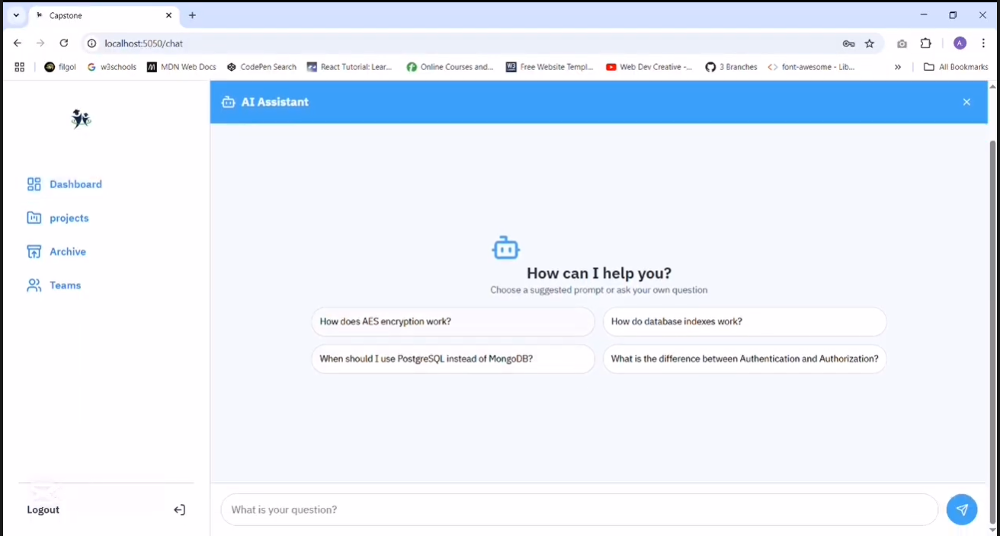

# Acad-Manager 🎓
### Comprehensive Graduation Project Management System

[](https://www.python.org/)
[](https://fastapi.tiangolo.com/)
[](https://reactjs.org/)
[](https://flutter.dev/)
[](https://laravel.com/)
[](https://www.mysql.com/)
[](https://jwt.io/)
[](https://en.wikipedia.org/wiki/Tf%E2%80%93idf)
[](https://pypi.org/project/bcrypt/)
[](https://www.php.net/)
[](https://developer.mozilla.org/en-US/docs/Web/JavaScript)
[](https://tailwindcss.com/)
[](https://dart.dev/)
[](https://ai.google.dev/gemini-api)
[](https://git-scm.com/)

## 📖 Overview

Acad-Manager is a comprehensive graduation project management system designed to streamline the entire lifecycle of academic projects in colleges. The platform facilitates seamless collaboration between three key user types: **Admins**, **Supervisors**, and **Students**, from initial team formation to final project submission.

The system leverages advanced technologies including machine learning for similarity detection, intelligent recommendation algorithms, and modern web/mobile frameworks to provide an intuitive and efficient project management experience.

## ✨ Key Features

### 🔐 Authentication & Authorization
- **JWT-based Authentication**: Secure token-based authentication system
- **Role-based Access Control**: Differentiated permissions for Admins, Supervisors, and Students
- **Password Security**: Industry-standard bcrypt hashing for password protection

### 👥 Team Management
- **Team Creation**: Students can form teams and invite members
- **Project Proposals**: Team leaders can submit and manage project ideas
- **Smart Recommendations**: AI-powered matching system for students and teams based on skills and requirements
- **College Ideas Integration**: Access to supervisor-proposed project concepts

### 📋 Project Management
- **Project Lifecycle Tracking**: Complete oversight from conception to completion
- **Similarity Detection**: Advanced TF-IDF and cosine similarity algorithms to ensure project originality
- **Idea Validation**: Automatic checking against existing projects and college databases
- **Status Management**: Real-time tracking of project approval status

### 💡 College Ideas System
- **Supervisor Proposals**: Faculty can submit project ideas for student adoption
- **Request Management**: Students can apply for college-proposed projects
- **Status Tracking**: Comprehensive monitoring of application states (Pending, Accepted, Rejected)

### 🎯 Intelligent Recommendations
- **Student-Team Matching**: Algorithm-based suggestions for optimal team compositions
- **Skill-based Pairing**: Matching based on complementary skills and project requirements
- **Similarity Scoring**: Quantitative metrics to guide decision-making

### 📝 Task Management
- **Task Assignment**: Supervisors can create and distribute tasks
- **Submission System**: Students can upload and manage task responses
- **Progress Tracking**: Real-time monitoring of task completion status

### 🤖 AI-Powered Chatbot
- **Project Support**: Intelligent assistance for project-related queries
- **Idea Generation**: AI-driven project idea recommendations
- **24/7 Availability**: Round-the-clock support for students and teams

## 🛠️ Technology Stack

### Backend Technologies
- **Python 3.9+** - Core backend development
- **FastAPI** - High-performance API framework
- **Flask** - Lightweight web framework
- **SQLAlchemy** - Database ORM
- **MySQL 8.0** - Primary database
- **Scikit-learn** - Machine learning algorithms
- **JWT** - Authentication tokens
- **bcrypt** - Password hashing
- **PHP 8.0+** - Server-side scripting
- **Laravel 11.0** - PHP web framework

### Frontend Technologies
- **React.js 18.0+** - Web frontend framework
- **JavaScript ES6+** - Client-side scripting
- **Tailwind CSS 3.0+** - Utility-first CSS framework

### Mobile Development
- **Flutter 3.0+** - Cross-platform mobile framework
- **Dart 2.17+** - Mobile app programming language

### Additional Technologies
- **Gemini API** - AI integration
- **Git** - Version control
- **Postman** - API testing

## 💡API Documentation

Experience Acad-Manager in action: [API Documentation](https://www.postman.com/capstone-ii/capstone-ii-p/collection/yecd8ka/capstone-ii?action=share&creator=27428449)

## 🎥 Demo

Experience Acad-Manager in action: [Watch Demo Video](https://drive.google.com/file/d/1lLzJWSNxQpqYcVwbgBHjs13liTdWQ4Q9/view?pli=1)

## 📸 Screenshots

### Authentication & Dashboard
<div align="center">
  
  
  
</div>

### Project Management
<div align="center">
  
  
  
</div>

### Team Collaboration
<div align="center">
  
  
</div>

### Task Management
<div align="center">
  
</div>

### Chatbot
<div align="center">
  
  
</div>

### Recommendations
<div align="center">
  
  
</div>

## 🚀 Getting Started

### Installation

1. **Clone the repository**
   ```bash
   git clone https://github.com/your-username/acad-manager.git
   cd acad-manager
   cd backend && python main.py

## Development Team
@AbdelrahmaAreef
@AhmedAbdelhadyISmail
@mansour3432
@mohamedwaely
@AmiraAbdEl-Rahman
@FathySaid
@MostafaHikal
@MohamedKandil
@BasmalaAbu-zaid